# TrackQuest SD

TrackQuest SD is a web application that helps runners discover and review races in San Diego. Users can explore upcoming races, read reviews from fellow runners, and track their race participation by editing their unique profile.

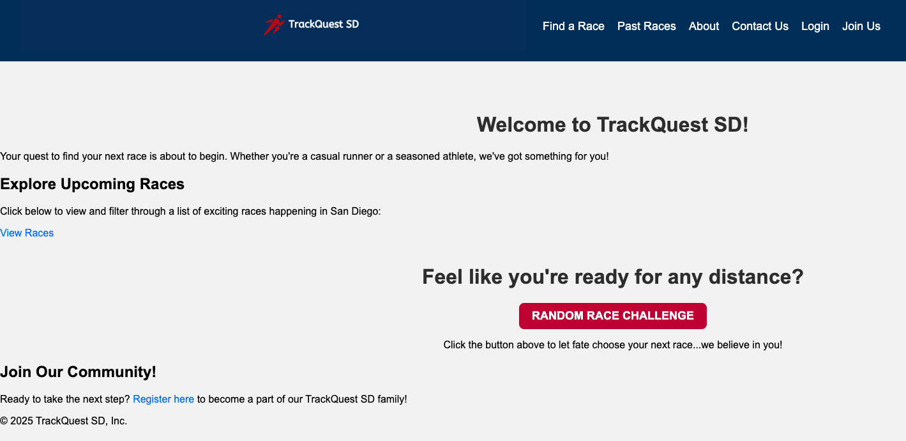

## Tech Stack
### Backend
- Python/Flask - RESTful API development
- SQLite - Database management
- SQLAlchemy ORM - Database modeling and migrations
- Flask-Login - User authentication
- Werkzeug - Security and password hashing
- Flask-Migrate - Database migrations
- Pandas - Data processing
- BeautifulSoup4 - Web scraping race data

### Frontend
- HTML/CSS - Responsive design
- JavaScript - Dynamic interactions
- React - Interactive Past Races page
- Jinja2 - Template engine
- TailwindCSS - Utility-first CSS

## Features

### Race Discovery
- Browse upcoming San Diego races

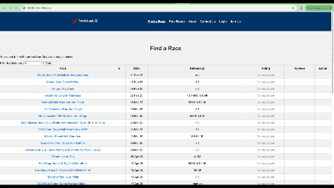

- Filter races by distance

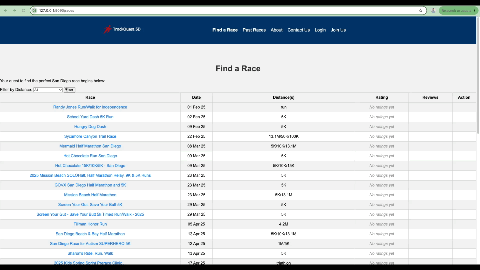

- Random race selector:
  - Ready to take on any challenge? Use the **random race** button to be redirected to the registration page of a random race that is upcoming. Perfect if you want to test your endurance across any event!

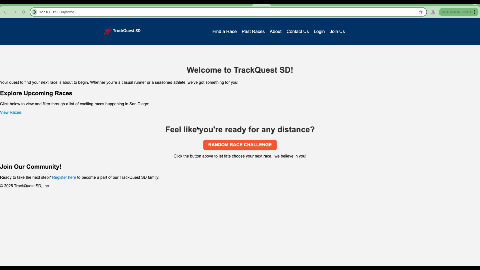
 
- View past race reviews and ratings

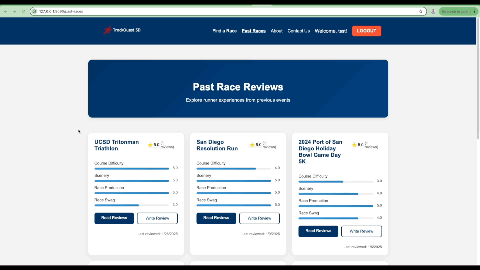

### User Features
- User authentication and profiles

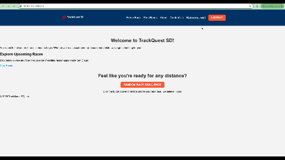

- Personal race tracking (upcoming and completed)
- Race review system with ratings
- Photo upload capability for race reviews

### Review System
- Rate races on multiple criteria (difficulty, scenery, etc.)
- View aggregated ratings
- Upload race photos
- Edit/delete your reviews

## Setup and Installation

1. Clone the repository
```bash
git clone [https://github.com/akonisanchez/track-quest.git]
```

2. Create and activate virtual environment
```bash
python -m venv venv (might need to do 'python3')
source venv/bin/activate  # On Windows: venv\Scripts\activate
```

3. Install dependencies
```bash
pip install -r requirements.txt
```

4. Run the application
```bash
python app.py (might need to do 'python3')
```

Access the application at `http://localhost:9090`

## Usage

- Create an account to start tracking races

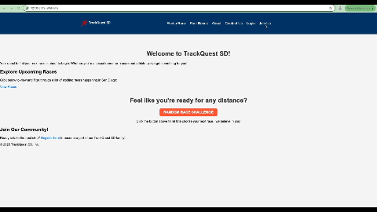

- Browse available races on the "Find a Race" page
- Read reviews on the "Find a Race" and "Past Races" pages

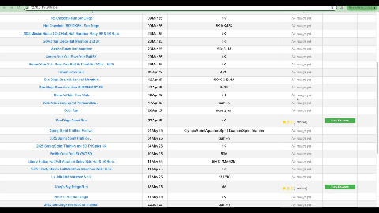

- Add races you plan to compete in to your profile

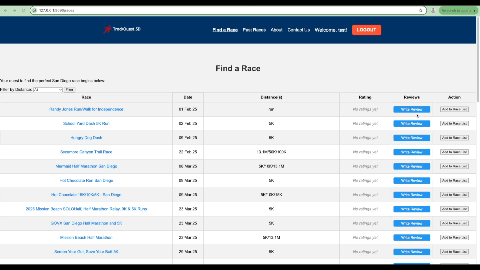

-Update your performance as you complete each race

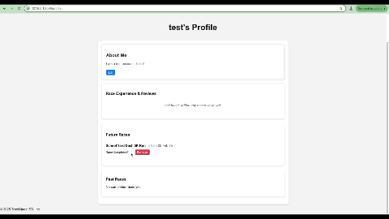

- Write reviews for races you've completed

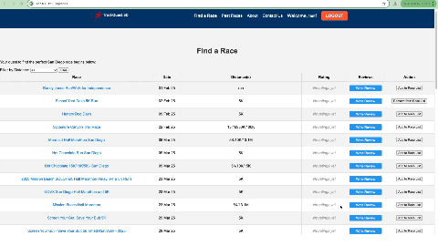
